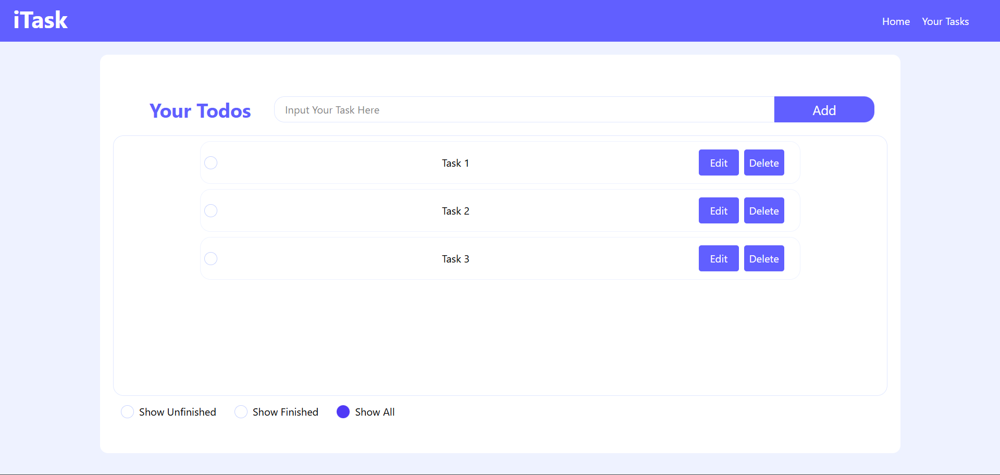

# 📝 React To-Do App

A simple and responsive To-Do List application built with **React**. This app allows users to manage their daily tasks efficiently by adding, deleting, and marking tasks as complete.

## 🚀 Features

- ✅ Add new tasks
- ❌ Delete tasks
- ❌ Edit tasks
- ✏️ Mark tasks as completed
- 🎨 Clean and minimalist UI
- 📱 Fully responsive design

## 📸 Screenshots



## 🛠️ Built With

- [React](https://reactjs.org/)
- [Vite](https://vitejs.dev/) *(or Create React App, if that's what you used)*
- [Tailwind CSS](https://tailwindcss.com/)
- [JavaScript](https://developer.mozilla.org/en-US/docs/Web/JavaScript)

<!-- ## 📂 Project Structure -->


## 🧑‍💻 Getting Started

Follow the steps below to run this project locally:

### 1. Clone the repository

```bash
git clone https://github.com/AbhinavSinghVishen/react-todo-app.git
cd react-todo-app
```
### 2. Install dependencies

```bash
npm install
```
### 3. Run the development server

```bash
npm run dev
```

### 4. Open in browser

```bash
Go to http://localhost:5173 or the port shown in the terminal.
```
## 🤝 Contributing
Contributions are welcome! If you find any bugs or want to add features, feel free to:

- Fork the repository

- Create a new branch:
    ```bash
    git checkout -b feature-name
    ```
- Commit your changes:
    ```bash
    git commit -m 'Add feature'
    ```
- Push to the branch:
    ```bash
    git push origin feature-name
    ```

- Create a Pull Request.

## 🙋‍♂️ Author
### Abhinav Vishen

- GitHub: @AbhinavSinghVishen

- LinkedIn: [Abhinav Vishen](www.linkedin.com/in/abhinav-vishen-9381871a0)

